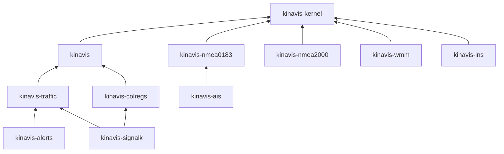

# KINAVIS

*Kinematic and Inertial Navigation Algorithms, Verification and Integrity Suite*

[](https://github.com/KINAVIS/kinavis/actions/workflows/ci.yml)
[](https://crates.io/crates/kinavis)
[](https://docs.rs/kinavis)


[](#license)

**Marine navigation for Rust** — NMEA 0183, NMEA 2000, AIS, GNSS, INS and the
COLREGs, from a `no_std` microcontroller to a workstation.

From the bytes a sensor sends to the numbers the officer of the watch acts on:
NMEA 0183, NMEA 2000, AIS and an IMU in; a position, a course to steer, a
collision assessment and a bridge alert out.

## Why KINAVIS

- **No panics** on anything a caller or a sensor can send. Checked, not
  promised: CI reads the emitted LLVM IR for any path to `core::panicking`.
- **No allocation.** Every collection is inline with a published bound, and
  every crate builds for `thumbv7em-none-eabihf` with no allocator at all.
- **No `unsafe`**, and no third-party dependencies in the default build.
- **Types that carry meaning.** A compass course cannot be passed where a true
  one belongs, a time in GPS cannot be mixed with UTC, knots cannot be
  mistaken for metres per second — the compiler refuses:

  ```text
  let course = TrueCourse::new(90.0)?;
  magnetic_to_true(course, variation);
                   ^^^^^^ expected `Direction<Magnetic>`, found `Direction<True>`
  ```

- **Reproducible.** A passage planned ashore and recomputed on the bridge is
  the same plan: the `std` and the pure-Rust `libm` maths are held to agree
  within 1e-13, and the estimator is a pure function that replays a voyage
  step by step.
- **Verified.** The parsers are fuzzed, and CI reads every sentence of
  gpsd's two hundred logs of real receivers against a recorded tally; the
  algorithms are checked against published reference values — NOAA's WMM test points, Vincenty's test
  lines, PROJ's datum shifts; and the filters pass Monte Carlo consistency
  tests.

## See it run

Four demonstrations in [`examples/`](examples/), each on data recorded from
real equipment — gpsd's receiver logs and a Signal K AIS recording:

| Demonstration | What it shows |
|---|---|
| `receivers` | seven receivers' NMEA, including an RTK receiver past 82 bytes and a line that lost bytes in transit, read or refused |
| `gnss_jump` | a yacht's track with one fix moved forty miles: `REFUSED  implausible jump: 144094 kn implied` |
| `traffic` | 1459 AIS messages off Harlingen decoded; CPA and TCPA of every ship against one of them |
| `course_to_steer` | the same yacht against a passage plan: cross-track error and the cross-track alarm |

```sh
cargo run -p kinavis-examples --example traffic
```

```text
ship                     bearing    range      CPA    TCPA  risk
245513000                075.0°T  35.61 M   0.12 M   76:02  developing
218784000                147.9°T   1.34 M   1.33 M    0:55  DANGEROUS
246754000                062.7°T  25.80 M   2.03 M   45:33  passing clear
```

## Crates



| Crate | What it does |
|---|---|
| [`kinavis-kernel`](https://docs.rs/kinavis-kernel) | the value types: frame-tagged angles, units, positions, time scales, geodesy and chart datums, events and the error type |
| [`kinavis`](https://docs.rs/kinavis) | the algorithms: compass and deviation, the sailings, dead reckoning, fixes, routes and guidance, tides, the sun, a Kalman filter over the navigation state |
| [`kinavis-nmea0183`](https://docs.rs/kinavis-nmea0183) | NMEA 0183 sentences, parsed and written |
| [`kinavis-nmea2000`](https://docs.rs/kinavis-nmea2000) | NMEA 2000 parameter groups out of CAN frames, fast-packet included |
| [`kinavis-ais`](https://docs.rs/kinavis-ais) | AIS messages: position reports, static and voyage data, aids to navigation |
| [`kinavis-wmm`](https://docs.rs/kinavis-wmm) | the World Magnetic Model 2025: magnetic variation at any position |
| [`kinavis-ins`](https://docs.rs/kinavis-ins) | a strapdown inertial navigation system with a fifteen-state error filter aided by GNSS and heading |
| [`kinavis-traffic`](https://docs.rs/kinavis-traffic) | target tracking from radar and AIS, CPA and TCPA, the avoiding manoeuvre |
| [`kinavis-colregs`](https://docs.rs/kinavis-colregs) | the steering and sailing rules of the COLREGs as data |
| [`kinavis-alerts`](https://docs.rs/kinavis-alerts) | bridge alert management: alarms, warnings and cautions, with acknowledgement |
| [`kinavis-signalk`](https://docs.rs/kinavis-signalk) | Signal K deltas in, CPA, TCPA and the COLREGs ruling out; the core of the [Signal K plugin](https://github.com/KINAVIS/signalk-kinavis) (`std`) |

An adapter depends on the kernel alone and never pulls in the algorithms;
take only the crates you need.

## Quick start

```toml
[dependencies]
kinavis = "1"
kinavis-nmea0183 = "0.1"
```

Fixes off the wire, and what to steer to stay on the planned track:

```rust
use core::time::Duration;
use kinavis::gnss_intake::{GnssIntake, IntakeConfig};
use kinavis::guidance::{guide, GuidanceConfig};
use kinavis::route::{LegKind, Route};
use kinavis::{Distance, EnvironmentSample, GeodeticPoint, GnssFix, Height, Position, Speed};
use kinavis_nmea0183::{parse, Sentence};

// The passage plan: north for thirty miles, then east.
let route = Route::new(
    &[
        "50°00.0'N 000°00.0'W".parse::<Position>()?,
        "50°30.0'N 000°00.0'W".parse::<Position>()?,
        "50°30.0'N 001°00.0'E".parse::<Position>()?,
    ],
    LegKind::RhumbLine,
)?;

// The receiver's sentences, read into fixes; a jump or a stale fix is refused.
let mut intake = GnssIntake::new(IntakeConfig {
    max_age: Duration::from_secs(10),
    max_speed: Speed::from_knots(40.0)?,
});
let mut now = None;
for line in [
    "$GPRMC,120000.00,A,5000.0000,N,00000.0000,W,10.0,0.0,110926,,,A*76",
    "$GPRMC,120001.00,A,5000.0028,N,00000.0000,W,10.0,0.0,110926,,,A*7D",
] {
    if let Ok(Sentence::Rmc(rmc)) = parse(line.as_bytes()) {
        if let Ok(fix) = GnssFix::try_from(rmc) {
            intake.accept(fix);
            now = Some((fix.taken_at(), fix.position()));
        }
    }
}
let (now, here) = now.expect("two good fixes");

// Course to steer and cross-track error.
let snapshot = intake.snapshot_at(now);
let sea = EnvironmentSample::at(GeodeticPoint::new(here, Height::above_ellipsoid(Distance::ZERO)), now);
let config = GuidanceConfig::new(Distance::from_cables(5.0)?, Distance::from_cables(2.0)?)?;
let (view, _events) = guide(&snapshot, &route, route.first_leg(), &sea, &config)?;

assert_eq!(format!("{}", view.desired_track()), "000.0°T");
println!("steer {}, {} off the track", view.course_to_steer(), view.cross_track_error().distance);
# Ok::<(), kinavis::NavigationError>(())
```

On a bare-metal target, turn the standard library off and take the pure-Rust
maths instead:

```toml
kinavis = { version = "1", default-features = false, features = ["libm"] }
```

The [guide](https://docs.rs/kinavis/latest/kinavis/guide/index.html) walks
through the rest — the sailings, fixing, deviation tables and the inverse
problem, the current triangle, errors, `serde`, and what each aggregate
weighs in memory — with examples that are compiled and run as tests.

## Help wanted: real hardware

Everything here is tested against recorded data, reference values and
simulation. What cannot be tested that way is how it behaves on a real bridge:
a GNSS receiver losing the sky, an NMEA 2000 backbone under load, an AIS
receiver in a crowded anchorage, an IMU strapped to a hull in a seaway, a
microcontroller with a real stack budget. If you have such equipment and would
run KINAVIS against it — or can share a recording of what it sends — please
[open an issue](https://github.com/KINAVIS/kinavis/issues). Logs from the sea
are worth more than any number of tests on land.

## Stability

`kinavis` and `kinavis-kernel` are at 1.x: within the major version nothing
documented is removed or changed in meaning, and every public enum is
`#[non_exhaustive]`, so match with a wildcard arm. The other crates are 0.x
and version on their own. The minimum supported Rust version is 1.85; raising it is a minor-version change.

## Documentation

- [docs.rs](https://docs.rs/kinavis) — the API of every crate, with examples.
- [`ARCHITECTURE.md`](ARCHITECTURE.md) — the layers, the dependency rule and the context map.
- [`SECURITY.md`](SECURITY.md) — the threat model and how to report a vulnerability.

## License

Licensed under either of [Apache License, Version 2.0](LICENSE-APACHE) or [MIT license](LICENSE-MIT) at your option.

Unless you explicitly state otherwise, any contribution intentionally submitted for inclusion in KINAVIS by you, as defined in the Apache-2.0 license, shall be dual licensed as above, without any additional terms or conditions.
